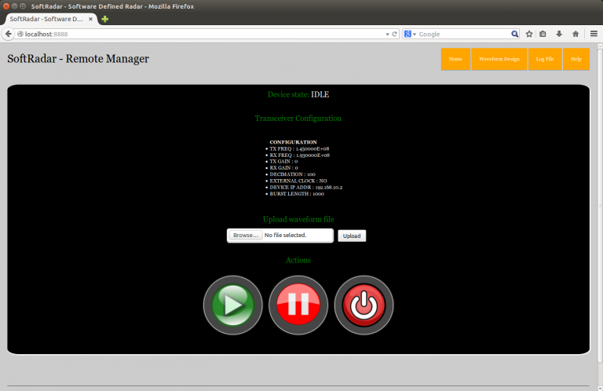
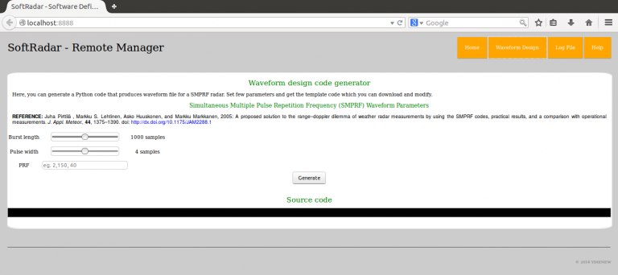
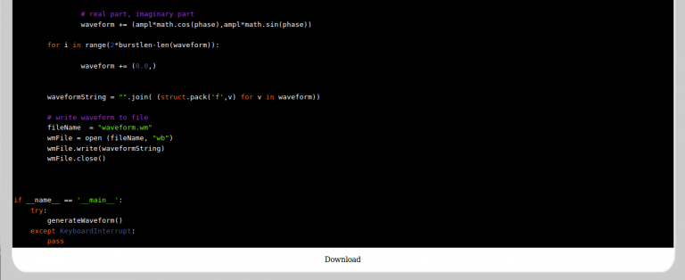
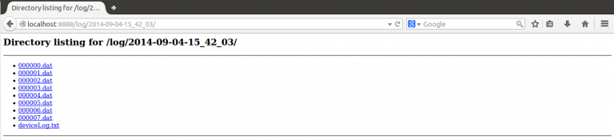

# softRadar

SoftRadar is a software defined radio that can transmit and receive (synchronoulsy) radar waveforms. Currently, it targets Universal Software Radio Peripheral (USRP) based hardwares only that support simultaneous Tx and Rx.

The main streaming program is written in C++ and is responsible for configuring the hardware, transmitting and receiving radar signals. Some of the hardware settings (frequency, gain, bandwidth,...) are configured via a configuration file (located in config/radarConfig.xml). Other real-time controls are handled through a UDP socket for possible remote control. You can download the source code from [here] (https://github.com/yDagne/softRadar.git).

## Compilation

1. Create out-of-source build directory

       $ cd ../path-to-this-source code--/
       $ mkdir build
       $ cd build

2. Configure and build the source

       $ cmake ..
       $ make
       
3. Copy the binary to the workspace folder
   
       $ cp apps/deviceManager ../workspace/
       
              
Make sure the compilation goes without error (which happend if you have not yet installed UHD driver, or if you have older versions of cmake,boost.
If you make any changes to the C++ source files, you need to repeat the steps 2 and 3.
     
     
## Usage:

SoftRadar can be run from the commnand-line or through a web-interface

Before executing the streamer, make sure you set appropriate parameters in the configuration file (located in config/radarConfig.xml).

### Command-line option:

1. Open a terminal window and change directory to 'workspace'
       
            $ cd ../path-to-this-source code--/workspace/
            
2. Make sure you set the parameters in the configuration file correctly.
       
3. Execute the program ('deviceManager') with appropriate command-line arguments. Type the following to see available options.
         
             $ ./deviceManager --h
             
           which prints the following
         
             softRadar options:
                     --help                       help message
                     --burstlen arg (=1000)       Burst size (1:12000) samples
	                   --record                     record received data
                     --wmfilename arg             Waveform file name
                     --logfilesize arg (=1000000) Log file size (samples)
                     --dir arg (=Data)            Log data directory
                     --srcport arg (=5700)        Port for sending commands
                     --destport arg (=5701)       Port for receiving replies
                     
4. Once the device manager is running, it is controled through UDP socket.
       
    Commands are sent via 'srcport' and replies are received via 'destport'
        
      Here is the list of commands that can be sent
          
             START          - starts the streamer
             STOP           - suspends the streamer
             TERMINATE      - shutdown the radio. This will terminate the program!
             GETSTATE       - request for device state (ACTIVE / IDLE)
             GETCONFIG      - request for configuration
             LOAD  [fname]  - upload new waveform file with the name [fname] 
             
          Every command should start with CMD
          
              Eg. 
                       "CMD LOAD Desktop/smprf_01.wm"
                       
          For commands that expect replies, the device manager sends the 
          response via 'destport'. Responses start with RSP
          
              Eg.
                      "RSP STATE ACTIVE"
                      "RSP BURSTLAG FAILURE file not found"
                      
5. Check the demo script in python/testCapture.py to see how to control the device manager. You might need to change the 'burstlen' to match it with configured value in config/radarConfig.xml.
         
###  Web interface:

This is the easiest option to run and control the radar. All you need to do is run the python webserver (radarHTTPSever.py) that automatically runs the device manager and provides a graphical interface for viewing configuration information
and executing real-time controls.

Note: You need to set your current directory to ---/workspace/. This keeps the source files clean from log files generated by the streamer if you enable recording of received samples.
      
      Running the webserver:
      
           $ ../python/radarHTTPSever.py -p [port number] -b [burst length (samples)]
           
              Set [portnumber] to a port that is not reserved for other TCP/IP
              services. The default value is 8888.

Set [burst length (samples)] to the number of radar waveform samples that are repeatedly transmitted.
              
When you run the server multiple-times, it might fail to connect to the UDP port. This usually happens when the client web browser is still running. To avoid this, use other port number (8889,...), and it is good to stop the server from the web interface (with TERMINATE button) so that the webserver forces all its threads to terminate, and the browser leaves that port.

##Remote Access to softRadar
  
As mentioned before softRadar can be remotely controlled through a web interface. This is possible only when the host computer is connected to the network and is visible from the other side where one want to access the radar. Once the web sever is started as follows
  
    $ ../python/radarHTTPSever.py -p [port number] -b [burst length (samples)]
  
we can see the graphical interface with the url [ip address]:[portnumber]. For example, to access the server from the same host machine serving on port number 8888, we use localhost:8888. Picture below shows snapshot of the graphical interface.

  

  
### softRadar is configured in three stages:

1. Configuration: is stored in softRadar-vxx/config/radarConfig.xml. This is a static configuration of the radar and cannot be changed while the radar is running. Therefore, the web server does not allow remote update of configuration file. However, one can use other methods (such as ssh). Changes to the configuration will take effect only when the web server is restarted.
  
2. Streaming: There are three streaming actions: START, STOP, TERMINATE.
  
 - START - tells the device manager to start transmitting the radar waveform, and record received samples to file. With 1 Msamples/s sampling rate, the device manager records 8 MBytes of data every second.
 - STOP - suspends the streaming.
 - TERMINATE - this has to be executed only when one wants to shutdown the web server or power OFF the radar and USRP.

 3. Waveform upload: One can generate and upload new waveform file at any time even when the radar is streaming. The device manager records events that occur while streaming. The file is located in softRadar-vxx/workspace/log/[start-date]/deviceLog.txt where [start-date] is the directory name created with the name taken from the date-string. Every time the streamer is started it automatically creates new directory.

 ## Waveform design tool
  
The web interface has a tool that generates python template code which can be downloaded and modified. The tool is designed as a basis for generating SMPRF radar waveforms. Picture below show snapshot of the interface.

  

### Example: SMPRF waveform
Let us generate waveform file for length-1 SMPRF waveform with the following parameters:
  <table border="0" align="left">
    <tbody>
    <tr>
      <td>Pulse Width</td>
      <td>2</td>
    </tr>
    <tr>
      <td>Pulse Repetition Intervals</td>
      <td>50,100,200,500</td>
    </tr>
    <tr>
      <td>Burst Length</td>
      <td>1000</td>
    </tr>
    <tr>
      <td>File Name</td>
      <td>waveform.wm</td>
    </tr>
    </tbody>
  </table>

  Set the parameters as shown below and press the<strong> Generate</strong> button.

  

This will generate a python script which you can download and modify.

  
  

You have to run the python script in order to create the waveform file which you can upload to the radar.

## Viewing/downloading log file

All recorded data and event log files can be viewed and downloaded from the web interface. The link to the log files in found in the top right navigation panel.

  
  

